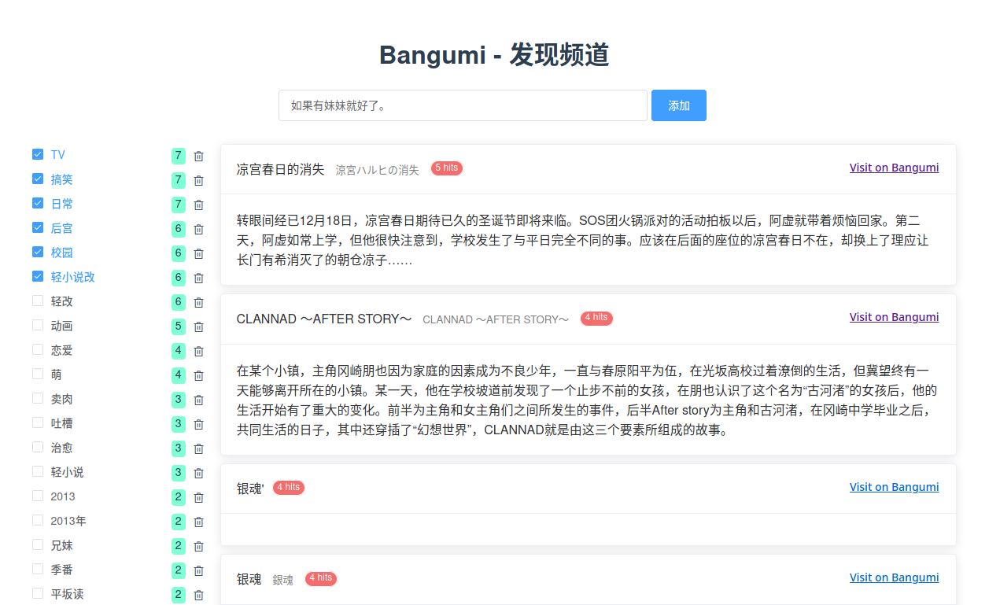
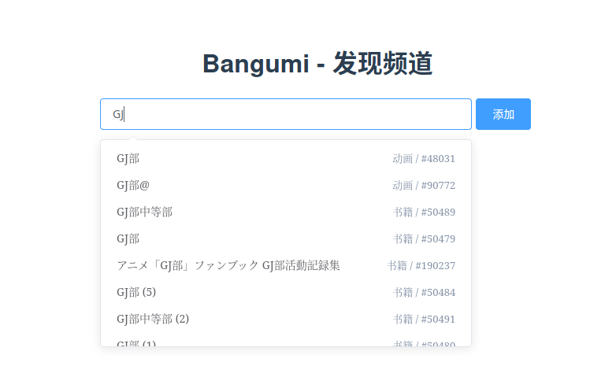

# Bangumi 发现频道

tl;dr 通过喜爱作品的公共标签发现潜在兴趣作品。

### 截图预览





### 构建

#### 前端构建

``` sh
yarn install
# yarn serve    # 开发版，支持热重载
yarn build    # 构建生产版本
# yarn lint     # （可选） linting
```

#### 后端 API 反代

由于 Bangumi 相关 API 尚未设置 CORS 相关 header（以及我们还需要从网页解析部分数据），此项目需要一个辅助反向代理服务器以提供完整服务。示例 nginx 配置文件 `nginx.conf` 在[这里](https://github.com/outloudvi/bgm-discover/blob/master/nginx.conf)。请记得同时修改 [`src/utils/bgm.ts`](https://github.com/outloudvi/bgm-discover/blob/master/src/utils/bgm.ts#L3) 中的服务器地址（以及请求路径，如果对配置文件进行了修改的话。）

### 协议

MIT